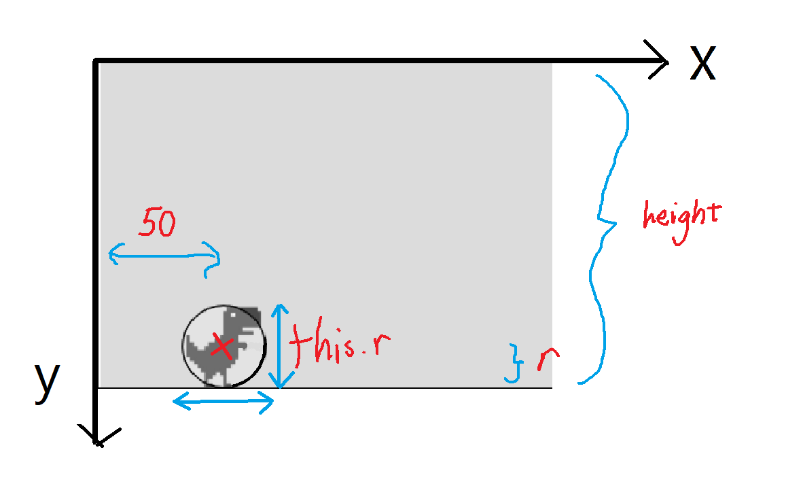
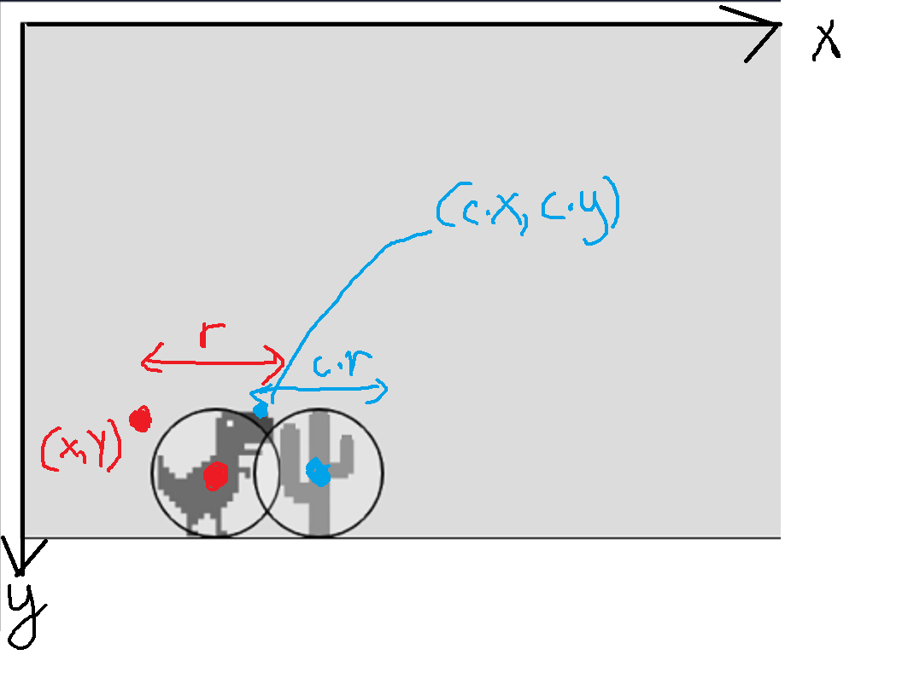

# Intro
In the template you'll find 5 files - `index.html`, `script.js`,  `style.css`, `dino.js`, and `cactus.js`

# Creating the Dino
First, let's create our dinosaur. Open up `dino.js`.

Let's define what our dino is. We'll be defining it as a `class` variable. In Javascript, a `class` is just a data type that can hold variables and functions all in one. Read about them more [here](https://developer.mozilla.org/en-US/docs/Web/JavaScript/Reference/Classes).

Inside `constructor()`, insert the following code:
```js
this.r = 50;
this.x = 50;
this.y = height - this.r;
```

We'll be modelling our sprites as circles, because it leaves some wiggle room so the game isn't too hard. That's what the `this.r` defines.

Although `r` normally is radius, but it's actually not (see diagram).

We also place it at the `x` value of `50` and the `y` value of `height - this.r` as illustrated below:


If you run the code nothing will show. This is because we haven't drawn the dino up on the screen yet. Add a new method inside the `class`:
```js
show() {
	image(dinoImg, this.x, this.y, this.r, this.r);
}
```

Then, in `script.js` add the following line inside the `setup()` function:
```js
dino = new Dino();
``` 
and in the `draw()` function:
```js
dino.show();
```

When you run it, you can see the dino now.

# I like to move it move it
Now let's make our dino actually do stuff like jumping woohoo.

First, add the following to `script.js`:
```js
...
function keyPressed() {
	if (key == ' ') {
		dino.jump();
	}
}

... 
function setup() { ... }
```
and the following inside `draw()`:
```js
dino.move();
```
Notice that `move()` and `jump()` are methods that we are going to add later.


Now, open `dino.js`. Create the following methods inside the Dino `class`:
```js
jump() {

}

move() {
	
}
```

First, we define a variable called `vy` inside the Dino `class` (the velocity in the y direction) and `gravity` (well, gravity) inside `constructor()`.

```js
this.vy = 0;
this.gravity = 0.5;
```

We want the dino game to simulate gravity. We can modify the variables `y` and `vy` in the `move()` function, which we called in `draw()`, at every frame our game is rendered like so:
```js
move(){
	this.y += this.vy;
	this.vy += this.gravity;
	this.y = constrain(this.y, 0, height - this.r)
}
``` 
This increments `vy` at each frame update, and constrains it to be between `0` (the ceiling) and `height - this.r` (which is just the floor).

Next, add the following to `jump()`:
```js
this.vy = -10;
```
This sets the velocity to `10`, which is upward. Run the code.

Oh no. This is fappy bird. We don't want fappy bird. We want the dinosaur to jump only when it's on the group, so modify `jump()`:
```js
jump() {
	if (this.y == height - this.r) {
		this.vy = -10;
	}
}
```
Yay! Dino can jump now!

# Making the Dino's life harder
Let's now add some cacti. Specifically, let's define what ONE cactus will behave like. Open up `cactus.js`.

Add the following code to the `constructor()` method:
```js
this.r = 50;
this.x = width;
this.y = height - this.r;
this.vx = 5;
```
This is similar to the dino. Next, we'll also define the `move()` and `show()` methods that our dino also has:

```js
move() {

}

show() {

}
```
Unlike the dino which moves only in the `y` direction, our cacti will be moving in the `x` direction.

Add the following line of code to the `move()` function:
```js
move(){
	this.x -= this.vx;
}
```
Next, we display the cactus on the screen in the `show()` method:
```js
show(){
	image(cactusImg, this.x, this.y, this.r, this.r);
}
```

Now that we've finished coding up what one cactus is like, let's implement them in the `script.js` file.

First we'll create an array of cacti at the top:
```js
let cacti = [];
```
Next, we'll spawn the cacti in the `draw()` function:
```js
if (cacti.length < 3) {
	if (random(1) < 0.01) {
		cacti.push(new Cactus());
	}
}
```
Notice that this code is very simple, but quite flawed - it first checks if there are less than 3 cacti in the game, and spawns them in randomly. The new cactus is then pushed into the array.

But this spawning means bad RNG so.... yea glhf tinkering with this later.

Next, we'll loop through all of the cacti and update them:
```js
for (let c of cacti) {
	c.move();
	c.show();

	// if out of screen, remove it
	if (c.x < -c.r) {
		cacti.shift();
	}

	// if collide with cactus, stop game
	if (dino.hits(c)) {
		console.log('game over');
		noLoop();
	}
}
```
The code is pretty self explanatory, but you can see that we need to implement collision detection on the dino (`dino.hits()`).

# Bonk or No Bonk
Open `dino.js`. Now, let's add a new method inside the Dino class:
```js
hits(c) {

}
```
Remember when we said we modelled our sprites as circles? We can now use formulas to find if they are ovelapping:


yes very confushen but basically find the distance between the two (d). If `d < (sum of radius)` then they are overlapping and we can stop the game. 

We can implement it here:
```js
let distance = dist(
	c.x + 0.5 * c.r,
	c.y + 0.5 * c.r,
	this.x + 0.5 * this.r,
	this.y + 0.5 * this.r
)

if (distance < 0.5 * (c.r + this.r)) {
	return true
}
```


# Conclusion
yayy u now have a dino game! congrats hope u survived

# Homework
Some ideas to improve the game:
- reload on spacebar
- show scores
- multiplayer???

### Source
Adapted from [the coding train](https://thecodingtrain.com/CodingChallenges/147-chrome-dinosaur.html)
